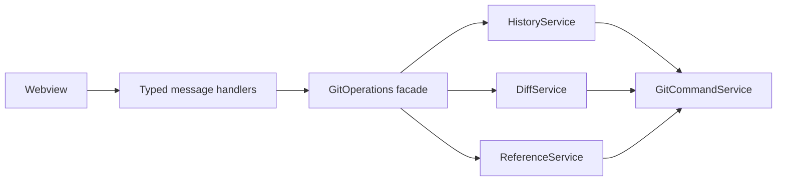

# Dashboard backend architecture

The redesigned dashboard uses a read-oriented backend instead of expanding the existing write-operation handlers. The UI requests only the data needed by the active view, commit, or file.

## Boundaries

- `GitCommandService` is the process and trust boundary. It executes Git without a shell, validates repository paths, validates file paths, and resolves revisions to commit hashes.
- `HistoryService` owns paginated commit history and history search. It returns commit parents so the webview can render a commit graph without parsing Git text.
- `DiffService` owns commit metadata, changed-file lists, and on-demand file patches. Patch output is capped at 1 MiB before it crosses the webview boundary.
- `ReferenceService` aggregates branches, tags, remotes, and stashes for the selected repository.
- `GitOperations` remains a thin facade. It exposes services to VS Code handlers but contains no parsing or view-specific state.
- `webviewMessageHandler` validates untrusted webview payloads and converts service results into typed events.

Existing write services remain separate:

- `BranchService`: create, checkout, pull, push, fetch, and delete branches.
- `SubmoduleService`: discover linked repositories and perform submodule-specific synchronization.
- `CommitService`: legacy recent-commit operations and remotes used by existing commands.

## Dashboard protocol

| Request | Response | Loading strategy |
|---|---|---|
| `getHistory` | `historyLoaded` | Page commits, default 100 and maximum 200 |
| `getCommitDetail` | `commitDetailLoaded` | Load after the user selects a commit |
| `getFileDiff` | `fileDiffLoaded` | Load after the user selects a changed file |
| `getRepositoryRefs` | `repositoryRefsLoaded` | Load after selecting a repository |
| Any failed read | `dashboardError` | Show an error in the affected view |

History supports repository path, page limit, offset, text search, branch selection, and optional remote refs. Search covers commit hash, author, email, subject, and decorated refs.

## Data flow

1. The panel loads the lightweight repository overview already used by Repository Manager.
2. Selecting a repository requests refs and the first history page in parallel.
3. Selecting a commit requests metadata and its changed-file list.
4. Selecting a file requests only that file's patch.
5. Write operations refresh the lightweight overview; the frontend invalidates history/detail data for the affected repository.

This avoids loading every commit and patch when the panel opens, keeps the extension responsive on large repositories, and allows each lower panel to display an independent loading or error state.

## Safety and limits

- Git arguments are passed through `execFile`; they are never concatenated into a shell command.
- Repository paths must stay inside the active workspace.
- File paths must be repository-relative.
- Revisions are resolved with `git rev-parse --verify <revision>^{commit}` before use.
- History commands use a 15-second timeout and bounded result counts.
- File patches are truncated at 1 MiB and marked with `truncated: true`.

## Follow-up adapters

The architecture leaves separate slots for `WorkingTreeService`, `ReflogService`, `WorktreeService`, and a GitHub pull-request adapter. These should be added as independent read services when their dashboard views are implemented; they should not be folded into `HistoryService` or `GitOperations`.
