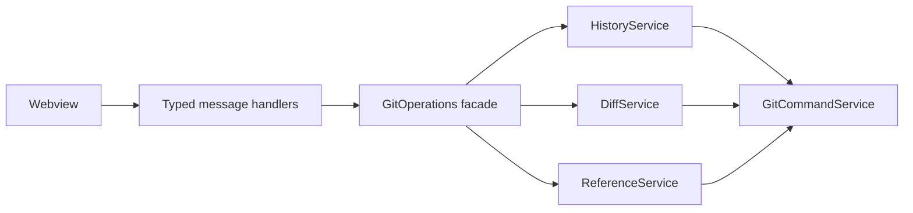

# Dashboard backend architecture

The redesigned dashboard uses a read-oriented backend instead of expanding the existing write-operation handlers. The UI requests only the data needed by the active view, commit, or file.

## Boundaries

```mermaid
flowchart LR
    W[Webview] --> H[Typed message handlers]
    H --> F[GitOperations facade]
    F --> HS[HistoryService]
    F --> DS[DiffService]
    F --> RS[ReferenceService]
    HS --> G[GitCommandService]
    DS --> G
    RS --> G
```

- `GitCommandService` is the process and trust boundary. It executes Git without a shell, validates repository paths, validates file paths, and resolves revisions to commit hashes.
- `HistoryService` owns paginated commit history and history search. It returns commit parents so the webview can render a commit graph without parsing Git text.
- `DiffService` owns commit metadata, changed-file lists, and on-demand file patches. Patch output is capped at 1 MiB before it crosses the webview boundary.
- `ReferenceService` aggregates branches, tags, remotes, and stashes for the selected repository.
- `GitOperations` remains a thin facade. It exposes services to VS Code handlers but contains no parsing or view-specific state.
- `webviewMessageHandler` validates untrusted webview payloads and converts service results into typed events.

Existing write services remain separate:

- `BranchService`: create, checkout, pull, push, fetch, and delete branches. Push uses the branch's own remote (`branch.<name>.remote`, else `origin`) and refuses a detached HEAD with a message instead of a Git error.
- `SubmoduleService`: discover linked repositories and perform submodule-specific synchronization. Each repository's status carries `changeCounts` (staged, modified, untracked, conflicted) from the same `status --porcelain=v2` call.
- `CommitService`: the commit dialog's working-tree changes, previews and commits, plus legacy recent-commit operations and remotes.

### Uncommitted changes

The dashboard asks for the active repository's working tree (`getWorkingTreeChanges` with `purpose: "dashboard"`; the commit dialog asks without it) after each history load and each repository list update. With changes, an **Uncommitted changes** row is shown above the history; it is not a commit row, so the graph and commit selection are unchanged. Selecting it lists the changed files and loads each one's staged or unstaged diff (`getWorkingTreePreview`, the commit dialog's preview, with its own request ids). With changes and no commit picked by the user in that repository, the dashboard selects the row; once the tree is clean it falls back to the newest commit. The detail pane is laid out like a commit's (title, counts, branch and `HEAD <sha> → working tree`, `*` for the hash), and the summary bar holds **Commit…**, **Review changes** and **Summarize changes**. Summarize sends `summarizeChanges` with `local: true`; the panel takes the same snapshot Review changes takes (`snapshotLocalChanges`) and summarizes HEAD → snapshot, so nothing is committed or staged. **Review commit** is disabled there: it reviews commits.

`LiveChanges` (`src/liveChanges.ts`) keeps this current: a workspace file watcher (VS Code's, which honours `files.watcherExclude`) reports events, and once they have been quiet for 800 ms one repository list refresh runs. Inside `.git`, only the index, HEAD, refs, packed-refs and info/exclude count; objects, logs, hooks and lock files are ignored, and so is an index rewrite in the 1.5 s after a refresh (`git status` writes it). A batch of only working-tree files is first checked with `git check-ignore --stdin` in the repository that holds each file (`src/services/ignoredPaths.ts`); when Git ignores all of them (build output, dependency folders), no refresh runs. A tracked file is never reported as ignored. A batch over 2000 files, or a check that fails, refreshes without checking. While the dashboard is hidden, or a Git action runs, the refresh waits and runs once afterwards. `repositoryManager.liveChanges` turns it off.

### Committing selected files

`commitFiles` builds the commit in a temporary index (`GIT_INDEX_FILE`) that starts from HEAD and receives only the selected files, then commits it. The real index is not touched until the commit exists, so a commit that fails (a rejecting hook, for example) leaves your staging exactly as it was, and staged files you did not select stay staged and uncommitted. A selected file that was staged and then changed again needs a choice (`partial`): `staged` commits the staged version and leaves the later changes unstaged; `whole` commits the file as it is in the working tree. Afterwards the selected paths' index entries are reset to the new commit. With `push`, the dialog pushes the current branch once the commit exists; a failed push keeps the commit and says so. The Push after commit choice is remembered per repository root in workspace state.

### Commit messages written by Copilot

**Write with Copilot** sends `generateCommitMessage` with the selected files and the partly staged choice. `CommitMessageController` (`src/commitMessageController.ts`, no VS Code dependency) collects the diff the commit would record (`collectCommitDiff` in `services/commitMessage.ts`: HEAD → working tree, or the staged part; at most 60 KB, larger files are named instead) and the repository's commit convention (`findCommitConvention`): the sections about commits in AGENTS.md, CLAUDE.md and CONTRIBUTING.md (also under `.github/` and `docs/`), plus a commitlint config. A repository with none of these gets Conventional Commits 1.0.0. Before sending code it asks only when `repositoryManager.copilot.askBeforeSending` says so, as a review does, and shares the review's per-repository "Always allow". The reply is cleaned (code fences, quotes and attribution trailers removed) and posted as `commitMessageGenerated`; the dialog puts it in the message box, keeps the previous draft for Undo, and says which convention was followed. Nothing is committed until the user commits.

## Dashboard protocol

| Request | Response | Loading strategy |
|---|---|---|
| `getHistory` | `historyLoaded` | Page commits, default 100 and maximum 200 |
| `getCommitDetail` | `commitDetailLoaded` | Load after the user selects a commit |
| `getFileDiff` | `fileDiffLoaded` | Load after the user selects a changed file |
| `getRepositoryRefs` | `repositoryRefsLoaded` | Load after selecting a repository |
| Any failed read | `dashboardError` | Show an error in the affected view |

History supports repository path, page limit, offset, text search, branch selection, and optional remote refs. Search covers commit hash, author, email, subject, and decorated refs.

## Data flow

1. The panel loads the lightweight repository overview already used by Repository Manager.
2. Selecting a repository requests refs and the first history page in parallel.
3. Selecting a commit requests metadata and its changed-file list.
4. Selecting a file requests only that file's patch.
5. Write operations refresh the lightweight overview; the frontend invalidates history/detail data for the affected repository.

This avoids loading every commit and patch when the panel opens, keeps the extension responsive on large repositories, and allows each lower panel to display an independent loading or error state.

## Safety and limits

- Git arguments are passed through `execFile`; they are never concatenated into a shell command.
- Repository paths must stay inside the active workspace.
- File paths must be repository-relative.
- Revisions are resolved with `git rev-parse --verify <revision>^{commit}` before use.
- History commands use a 15-second timeout and bounded result counts.
- File patches are truncated at 1 MiB and marked with `truncated: true`.

## Follow-up adapters

The architecture leaves separate slots for `WorkingTreeService`, `ReflogService`, `WorktreeService`, and a GitHub pull-request adapter. These should be added as independent read services when their dashboard views are implemented; they should not be folded into `HistoryService` or `GitOperations`.
